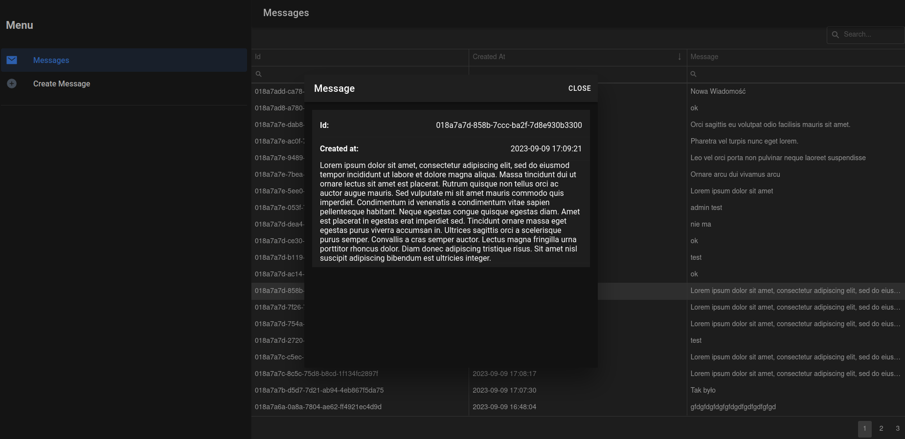

#  simple-message-file-storage

Just an API that saves messages to a file.

## Installation

Prepare application:

    git clone git@github.com:mikoweb/simple-message-file-storage.git
    wget https://getcomposer.org/download/latest-stable/composer.phar
    php8.2 composer.phar install

    sudo setfacl -dR -m u:"www-data":rwX -m u:$(whoami):rwX var
    sudo setfacl -dR -m u:"www-data":rwX -m u:$(whoami):rwX resources

Run from `docker-compose.yml`:

    docker compose up --build

If you don't use the app, delete docker containers, images etc. (**You do it at your own risk ;p**):

    docker system prune -a

## Links

* [Frontend](./frontend/README.md)

## Screenshots

